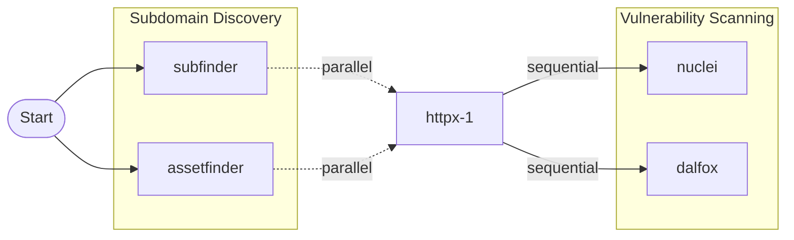

# Termaid Matrix System Documentation

## Overview

Termaid v2.0 introduces an enhanced matrix-based workflow system that provides precise 2D positioning control for nodes, enabling sophisticated parallel execution patterns and improved visualization. The system uses a coordinate matrix where X represents layers (execution phases) and Y represents positions within layers.

## Core Concepts

### 2D Matrix Positioning

Every node in a workflow has two coordinates:
- **X-axis (Layer)**: Horizontal position representing execution phase
- **Y-axis (Position)**: Vertical position within the layer

```
Layer 0    Layer 1    Layer 2    Layer 3
   |          |          |          |
   v          v          v          v
┌─────┐   ┌─────────┐ ┌─────────┐ ┌─────────┐
│Input│──▶│Tool-A[0]│─│Tool-C[0]│─│Tool-E[0]│ ◄─ Position 0
└─────┘   │Tool-B[1]│ │Tool-D[1]│ └─────────┘
          └─────────┘ └─────────┘            ◄─ Position 1
```

### Node Structure

```json
{
  "id": "subfinder-1",
  "tool": "subfinder",
  "args": "-d {{domain}} -silent -o {{output}}",
  "children": ["httpx-1"],
  "layer": 1,           // X coordinate
  "position": 0,        // Y coordinate  
  "parallel": true,     // Can run concurrently
  "subgraph": "enum",   // Optional grouping
  "sub_x": 0,          // Position within subgraph
  "sub_y": 0           // Position within subgraph
}
```

## Workflow Format v2.0

### Complete Structure

```json
{
  "version": "2.0",
  "matrix": {
    "max_x": 3,
    "max_y": 2
  },
  "subgraphs": [
    {
      "id": "parallel_enum",
      "name": "Parallel Subdomain Enumeration",
      "parallel": true,
      "nodes": ["subfinder-1", "assetfinder-1", "amass-1"]
    }
  ],
  "workflow": [
    // Node definitions with matrix coordinates
  ]
}
```

### Version Detection

The system automatically detects workflow format:
- **v2.0**: Matrix-based with `"version": "2.0"` field
- **v1.x**: Legacy format, auto-converted to matrix positions

## Subgraphs

Subgraphs enable logical grouping and advanced parallel execution patterns.

### Benefits
- **Visual Organization**: Group related tools
- **Parallel Execution**: All nodes in a parallel subgraph run concurrently
- **Resource Management**: Control concurrency at subgraph level
- **Dependency Management**: Clear execution boundaries

### Example: Parallel Subdomain Discovery

```json
{
  "id": "subdomain_enum",
  "name": "Parallel Subdomain Enumeration", 
  "parallel": true,
  "nodes": ["subfinder-1", "assetfinder-1", "amass-1"]
}
```

All three tools run simultaneously, results are merged before proceeding to next layer.

## Execution Model

### Sequential vs Parallel

**Sequential Execution** (`parallel: false`):
- Tools run one after another
- Output from one becomes input to next
- Safer for tools that modify shared resources

**Parallel Execution** (`parallel: true`):
- Tools run simultaneously  
- Same input fed to all tools
- Results merged and deduplicated

### Execution Order Algorithm

1. **Layer-by-Layer**: Process layers sequentially (X-axis)
2. **Position Groups**: Within each layer, group by Y coordinate
3. **Parallel Detection**: Check if nodes can run concurrently
4. **Resource Allocation**: Apply concurrency limits
5. **Result Merging**: Combine outputs before next layer

```
Step 1: [subfinder-1, assetfinder-1] (parallel)
Step 2: [dnsx-1] (sequential)
Step 3: [httpx-1, naabu-1] (parallel)
Step 4: [nuclei-1] (sequential)
```

## Left-to-Right Visualization

### Mermaid Graph Layout

The system generates `graph LR` (left-to-right) Mermaid diagrams:



### Edge Styling

- `-->|sequential|`: Normal sequential flow
- `-.->|parallel|`: Parallel execution indicator
- `-->`: Default connection

## Builder UI: 2x2 Layout

The workflow builder uses a precise 2x2 layout:

```
┌─────────────┬─────────────────────────────────┐
│    Tools    │        Input/Args Area          │
│   (20%w,    │         (80%w, 20%h)           │
│   80%h)     │                                 │
├─────────────┼─────────────────────────────────┤
│    Help     │      Matrix Visualization       │
│   Info      │         (80%w, 80%h)           │
│ (20%w,20%h) │                                 │
└─────────────┴─────────────────────────────────┘
```

### Controls

| Key | Action | Description |
|-----|--------|-------------|
| `tab`/`shift+tab` | Focus cycle | Navigate between panels |
| `↑/↓` | Navigate | Move within lists/layers |
| `←/→` | Horizontal move | Navigate nodes in same layer |
| `n`/`enter` | Add node | Add selected tool to workflow |
| `r` | Remove | Delete selected node |
| `c` | Commit args | Save argument changes |
| `m` | Move node | Change node position |
| `p` | Toggle parallel | Enable/disable parallel execution |
| `s` | Save | Export workflow with matrix data |

### Matrix Display

The visualization shows nodes in matrix format:

```
Matrix: 4x3 (X=layers, Y=positions)

▶ L0: input
  L1: P0[subfinder-1∥,assetfinder-1∥] | P1[amass-1]
  L2: P0[dnsx-1]  
  L3: P0[httpx-1] | P1[nuclei-1∥,dalfox-1∥]

Selected: subfinder-1 at [1,0]
```

Legend:
- `∥` indicates parallel execution enabled
- `P0[...]` shows position 0 with nodes
- `▶` marks current focus layer

## Migration Guide

### From v1.x to v2.0

Old format workflows are automatically converted:

```json
// v1.x format
{
  "workflow": [
    {
      "id": "subfinder-1",
      "tool": "subfinder", 
      "args": "-d {{domain}} -o {{output}}",
      "children": ["httpx-1"],
      "layer": 1
    }
  ]
}
```

Becomes:

```json
// v2.0 format  
{
  "version": "2.0",
  "matrix": {"max_x": 2, "max_y": 1},
  "workflow": [
    {
      "id": "subfinder-1",
      "tool": "subfinder",
      "args": "-d {{domain}} -o {{output}}",
      "children": ["httpx-1"],
      "layer": 1,
      "position": 0,
      "parallel": false
    }
  ]
}
```

### Conversion Process

1. **Position Assignment**: Auto-assign Y coordinates based on order
2. **Parallel Detection**: Analyze for potential parallel execution
3. **Matrix Bounds**: Calculate max_x and max_y
4. **Validation**: Ensure no coordinate conflicts

## Best Practices

### Matrix Design

1. **Layer Planning**: Design layers based on data dependencies
2. **Position Spacing**: Leave gaps for future nodes
3. **Parallel Grouping**: Group similar tools for concurrent execution
4. **Resource Consideration**: Balance parallelism with system resources

### Subgraph Usage

1. **Logical Grouping**: Group tools by function (enum, scan, etc.)
2. **Parallel Boundaries**: Use for clear concurrency control
3. **Naming Convention**: Use descriptive subgraph names
4. **Size Limits**: Keep subgraphs manageable (3-5 tools)

### Performance Optimization

1. **Concurrency Tuning**: Match parallel groups to CPU cores
2. **I/O Intensive Tools**: Group network-heavy tools together
3. **Memory Management**: Consider tool memory usage in grouping
4. **Resource Balancing**: Mix CPU and I/O intensive operations

## Examples

### Simple Sequential Chain

```json
{
  "version": "2.0",
  "matrix": {"max_x": 3, "max_y": 0},
  "workflow": [
    {
      "id": "subfinder-1", "layer": 1, "position": 0,
      "children": ["httpx-1"], "parallel": false
    },
    {
      "id": "httpx-1", "layer": 2, "position": 0,
      "children": ["nuclei-1"], "parallel": false
    },
    {
      "id": "nuclei-1", "layer": 3, "position": 0,
      "children": [], "parallel": false
    }
  ]
}
```

### Complex Parallel Workflow

```json
{
  "version": "2.0",
  "matrix": {"max_x": 4, "max_y": 2},
  "subgraphs": [
    {
      "id": "enum", "parallel": true,
      "nodes": ["subfinder-1", "assetfinder-1", "amass-1"]
    },
    {
      "id": "scan", "parallel": true,
      "nodes": ["nuclei-1", "dalfox-1"]
    }
  ],
  "workflow": [
    // Layer 1: Parallel enumeration
    {"id": "subfinder-1", "layer": 1, "position": 0, "parallel": true, "subgraph": "enum"},
    {"id": "assetfinder-1", "layer": 1, "position": 1, "parallel": true, "subgraph": "enum"},
    {"id": "amass-1", "layer": 1, "position": 2, "parallel": true, "subgraph": "enum"},
    
    // Layer 2: DNS resolution  
    {"id": "dnsx-1", "layer": 2, "position": 0, "parallel": false},
    
    // Layer 3: Web probing
    {"id": "httpx-1", "layer": 3, "position": 0, "parallel": false},
    
    // Layer 4: Parallel vulnerability scanning
    {"id": "nuclei-1", "layer": 4, "position": 0, "parallel": true, "subgraph": "scan"},
    {"id": "dalfox-1", "layer": 4, "position": 1, "parallel": true, "subgraph": "scan"}
  ]
}
```

## API Reference

### DAG Methods

```go
// Core matrix operations
func (g *DAG) AddNodeAtPosition(parentID, nodeID, tool, args string, layer, position int, subgraph string, parallel bool) error
func (g *DAG) MoveNode(nodeID string, newLayer, newPosition int) error
func (g *DAG) GetCoordinate(nodeID string) (Coordinate, bool)
func (g *DAG) GetNodesAtCoordinate(coord Coordinate) []*Node

// Matrix management
func (g *DAG) GetLayerMatrix(layer int) map[int][]*Node
func (g *DAG) GetParallelNodes(layer int) [][]*Node
func (g *DAG) GetExecutionOrder() [][]string
func (g *DAG) ValidateMatrix() error

// Subgraph operations
func (g *DAG) GetSubgraphNodes(subgraphID string) []*Node
func (g *DAG) CompactLayer(layer int)
```

### Coordinate System

```go
type Coordinate struct {
    X int // Layer (horizontal)
    Y int // Position (vertical)
}

type Node struct {
    Layer    int    // X coordinate
    Position int    // Y coordinate
    Subgraph string // Optional grouping
    SubX     int    // Local X in subgraph
    SubY     int    // Local Y in subgraph
    Parallel bool   // Concurrency flag
}
```

## Troubleshooting

### Common Issues

**Matrix Validation Errors**
- Coordinate conflicts: Multiple non-parallel nodes at same position
- Missing matrix entries: Nodes not properly indexed
- Solution: Use `ValidateMatrix()` and `CompactLayer()`

**Execution Order Problems**
- Dependency cycles: Circular references in children
- Missing dependencies: Orphaned nodes
- Solution: Check `GetExecutionOrder()` output

**Parallel Execution Issues**
- Resource conflicts: Too many concurrent tools
- Memory exhaustion: Large parallel groups
- Solution: Tune concurrency limits, split subgraphs

### Debug Commands

```bash
# Validate workflow matrix
termaid validate workflow.json

# Show execution plan  
termaid plan workflow.json

# Test workflow dry-run
termaid test workflow.json
```

## Future Enhancements

- **3D Matrix**: Z-axis for conditional branching
- **Dynamic Positioning**: Runtime position adjustment
- **Resource Profiles**: Memory/CPU aware scheduling
- **Visual Editor**: Drag-and-drop matrix positioning
- **Template Library**: Pre-built matrix patterns